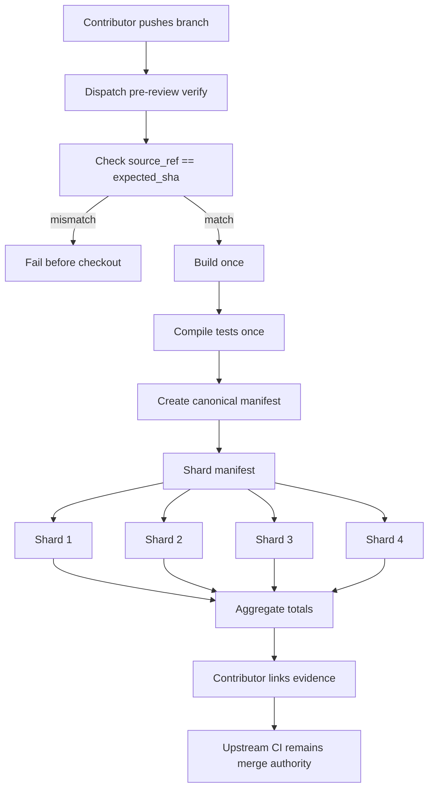

# Sharded pre-review verification proposal

This document is a draft review artifact for issue #2176. It describes a contributor-developed
workflow for producing faster, reproducible pre-review validation evidence and links the concrete
review implementation in this draft PR. It is not a proposal to replace the upstream merge gate.

## Summary

The proposed workflow is an optional, manually dispatched pre-review verification tier for broad
changes. A contributor pushes a branch, supplies the exact expected SHA, and dispatches a clean
remote runner workflow that builds once, compiles tests once, partitions the compiled unit-test
manifest into deterministic shards, and aggregates the result fail-closed.

Upstream `ci.yml` remains the only merge authority. This workflow is intended to improve the
feedback loop before asking maintainers to review a broad change.

## Why this exists

While preparing multiple upstream fixes, local broad verification was often the slowest and least
reliable part of the contributor loop. A laptop can produce noisy failures under CPU or thermal
contention, but waiting for full PR CI means finding broad validation problems later, after the PR
is already in front of maintainers.

The contributor-side workflow developed for this fork tries to make that middle step faster and
more transparent:

- verify one exact pushed commit;
- fail before checkout when branch and SHA do not match;
- run on a clean remote runner instead of a busy local machine;
- produce a single run URL and aggregate totals that can be linked from a PR;
- keep the real upstream CI gate unchanged.

## Files In This Draft PR

The draft PR includes the implementation shape for review, not because it should be merged exactly
as-is without maintainer direction:

- `.github/workflows/pre-review-verification-sharded.yml` — optional manual workflow that validates
   a branch/SHA pair, builds once, compiles tests once, partitions a canonical compiled-test manifest,
   runs deterministic shards, runs the lifecycle gate once, and aggregates totals fail-closed.
- `scripts/pre-review-verify.sh` — contributor helper for dispatching the workflow only after
   `git ls-remote` proves `source_ref` resolves to `expected_sha`. The first draft includes
   `dispatch` and `status`; richer `watch`, `resume`, `logs`, and `triage` commands can be added
   if maintainers want the full contributor-side ergonomics upstream.

## Existing Contributor Harness

The omitted operational pieces are already implemented in the separate public
[`pimmink/gsd-pi-ci`](https://github.com/pimmink/gsd-pi-ci/tree/chore/remote-verify-triage)
repository. They are linked rather than copied here so this draft stays focused on whether the
core upstream workflow shape is wanted.

| Component | Purpose |
| --- | --- |
| [`remote-pr-verification-sharded.yml`](https://github.com/pimmink/gsd-pi-ci/blob/chore/remote-verify-triage/.github/workflows/remote-pr-verification-sharded.yml) | Primary clean-runner tier: derives a manifest from the checked-out commit, runs deterministic shards, verifies coverage, and can collect advisory timing evidence. |
| [`remote-pr-verification.yml`](https://github.com/pimmink/gsd-pi-ci/blob/chore/remote-verify-triage/.github/workflows/remote-pr-verification.yml) | Independent stable, unsharded fallback when the sharded harness itself needs a cross-check. |
| [`remote-full-gate.yml`](https://github.com/pimmink/gsd-pi-ci/blob/chore/remote-verify-triage/.github/workflows/remote-full-gate.yml) | Separate clean-runner reproduction for full-gate experimentation; it is not asserted to be upstream merge parity. |
| [`remote-verify.sh`](https://github.com/pimmink/gsd-pi-ci/blob/chore/remote-verify-triage/scripts/remote-verify.sh) | Safe dispatch helper plus `status`, compact `watch`/`resume`, browser `open`, totals-focused `logs`, and advisory first-failure `triage`. |
| [`validate-timing-evidence.mjs`](https://github.com/pimmink/gsd-pi-ci/blob/chore/remote-verify-triage/scripts/validate-timing-evidence.mjs) | Validates optional timing artifacts against SHA, manifest, workflow, lockfile, runner, and schema provenance before publication. |
| [`remote-verification-guide.md`](https://github.com/pimmink/gsd-pi-ci/blob/chore/remote-verify-triage/docs/remote-verification-guide.md) | Operational contract: tier selection, exact-SHA rules, native staging, `pipefail`, logging, timing, fallback, and authority boundaries. |
| [`phase-2-deferral.md`](https://github.com/pimmink/gsd-pi-ci/blob/chore/remote-verify-triage/docs/phase-2-deferral.md) | Evidence and explicit deferrals for merge-parity scope, including Windows, Node 22, and Docker e2e. |

Operationally, a contributor dispatches the sharded tier with a full SHA, follows it with
`watch` or `resume`, uses `logs` for final totals, and uses `triage` only for a bounded first
diagnostic step after a failed job. The stable workflow is the independent fallback if the
sharded harness is under suspicion. The upstream PR's own CI remains merge authority throughout.

## Proposed shape

Core properties:

- `workflow_dispatch` only at first;
- inputs: `source_ref`, full 40-character `expected_sha`, optional `shard_count`;
- no token checkout for public source reads;
- exact-SHA verification before and after checkout;
- one build/compile step produces the test artifacts;
- the checked-out commit's own test script determines the canonical test manifest;
- shards run precomputed, non-overlapping manifest partitions;
- aggregate job verifies coverage and fails on any failed test;
- stable unsharded fallback remains available.

## Cost and timing evidence

The evidence supports a faster contributor feedback loop, not a blanket cost or sustainability
claim.

| Measurement | Result |
| --- | --- |
| Stable unsharded reference | about 19m11s wall-clock |
| Sharded proof run | about 12m04s wall-clock |
| Wall-clock reduction | about 37% |
| Unsharded summed runner time | about 19.2 runner-minutes |
| Sharded summed runner time | about 27.1 runner-minutes |
| Public fork GitHub billing API | `billable.UBUNTU.total_ms: 0` for measured runs |

On paid per-minute runner billing, the measured sharded proof is faster but not inherently cheaper
in raw compute minutes. Using GitHub's published baseline Linux rate of $0.006/min, the calibrated
comparison would be roughly $0.16 sharded versus $0.12 unsharded. At GitHub's Linux 4-core larger
runner rate of $0.012/min, it would be roughly $0.32 versus $0.23.

Upstream currently uses Blacksmith 4-vCPU Linux runners. Blacksmith publicly advertises lower
per-minute Ubuntu pricing and faster hardware, but the real maintainer cost depends on the
project's runner plan, OSS terms, concurrency constraints, and whether faster feedback is worth
parallel runner capacity.

## Guardrails

This should not be represented as merge parity.

Out of scope unless maintainers explicitly ask for it:

- replacing upstream `ci.yml`;
- reproducing every PR/merge gate;
- Windows portability parity;
- Node 22 smoke parity;
- conditional Docker e2e parity;
- claiming carbon or sustainability wins without energy evidence.

The first reviewable version should stay conservative: optional, manual, documented, and easy to
discard if maintainers prefer contributor-side tooling only.

## What This Draft Deliberately Leaves Out

The contributor-side harness has more operational affordances than this first upstream draft.
Those pieces are useful locally, but they would make the initial PR much harder to review:

- `watch` / `resume` output that only reports job-status changes;
- `logs` parsing that extracts final pass/fail/skip totals from job logs instead of trusting the
   green checkmark alone;
- first-failure `triage` classification;
- optional per-file timing collection and provenance validation;
- a stable unsharded fallback workflow;
- any merge-parity reproduction of Windows, Node 22 smoke, or Docker e2e jobs.

The review question for maintainers is whether the core shape is useful. If yes, the helper and
workflow can be extended incrementally; if no, those pieces should remain contributor-side tooling.

## Review questions

1. Would a contributor-facing, manually dispatched pre-review verification tier be useful upstream?
2. Should this stay in contributor forks instead of the main repository?
3. If upstream wants it, should it run on the same runner provider as `ci.yml` or on standard
   GitHub-hosted Linux runners?
4. Is the extra summed runner time acceptable for a faster review loop?
5. Which parts, if any, should be promoted first: exact-SHA dispatch, manifest sharding, aggregate
   evidence, or only the documentation pattern?
6. Should the richer helper ergonomics (`watch`, `resume`, `logs`, `triage`) and timing evidence
   stay contributor-side or be added later after the core workflow shape is accepted?
